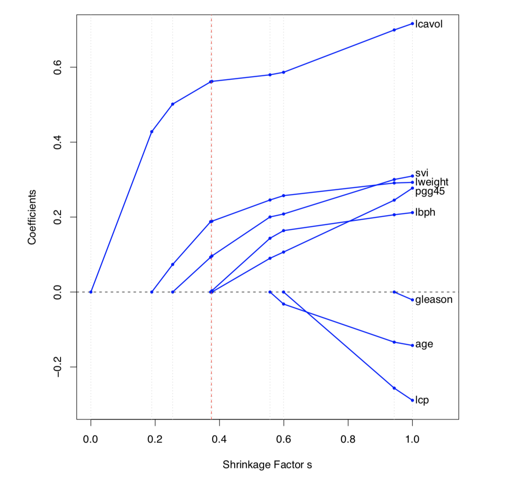
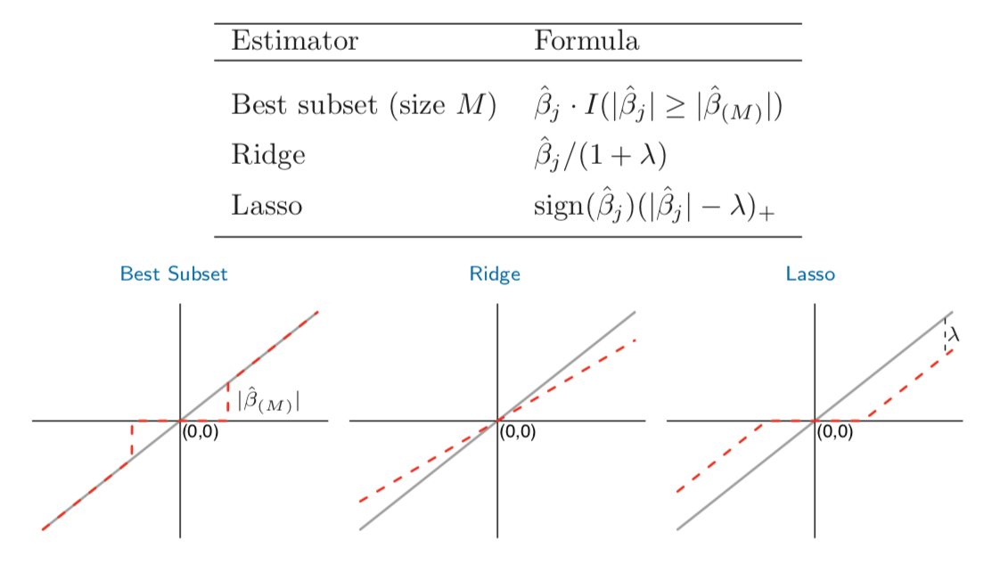
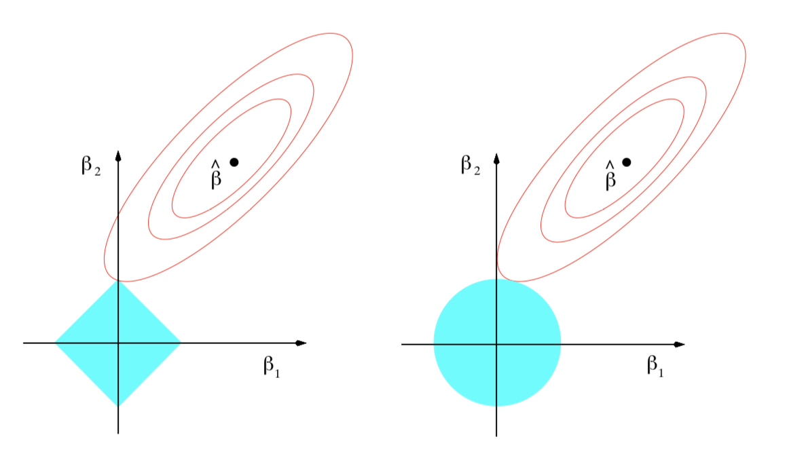
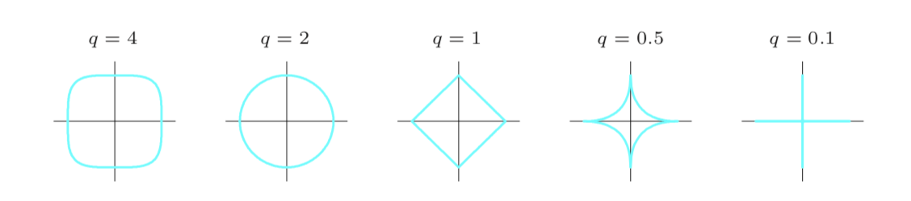
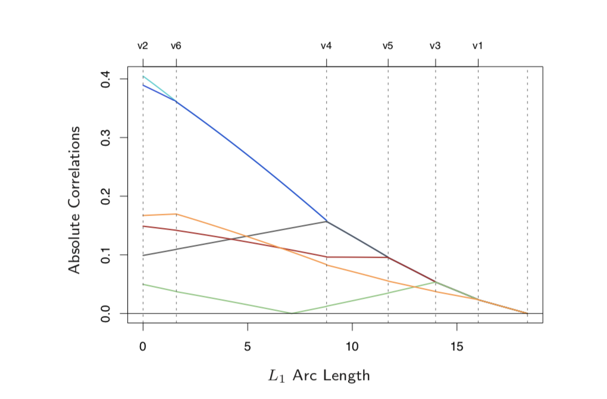
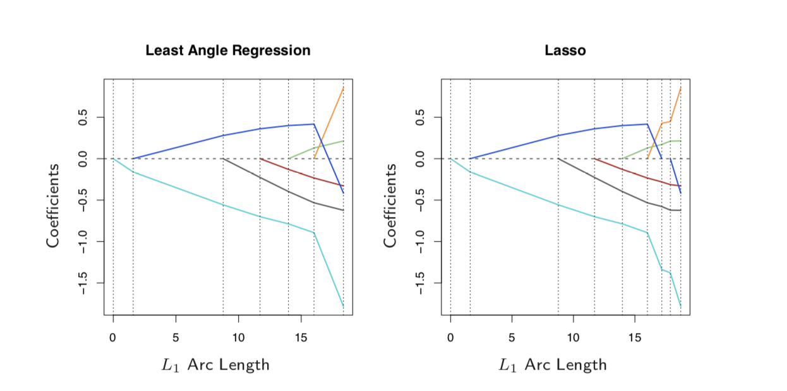

```{r setup, include=FALSE}
knitr::opts_chunk$set(echo = TRUE)
```

# The problem

There are two main problems with least square estimation. 
1. Prediction accuracy : least square minimizes biases, but this can be at the cost of high variance. Least squares exhibits an arbitrage between bias and reduced variance. 
2. Interpretations: when we have large number of predictors, we like to be able to determine a smaller subset that exhibits strongest effect. Least squares exhibits an arbitrage between details and big picture. 

# Subset selection 

The first class of procedures that help us solve these problems is subset selection. They all aim to select the set of predictors that minimize the sum of squared residuals (RSS), given a number $k \leq p$ of predictors.  

Because the RSS is strictly is monotonically decreasing in $k$, these procedures do not inform on how to choose the number of predictors in a model. Choice of $k$  is governed by a trade-off between bias and variance, and a subjective desire for parsimony. 

## Best subset selection 

This procedure is implementable when p, the number of predictors, is less than 40. 

$\forall k \in {0,1,2,....p}$ find the subset of size $k$ that gives the smallest sum of square residuals.  

One of the strengths of this approach is that it is not nested, and therefore gives more flexibility. 

## Forward/Backward stepwise selection 

Instead of searching all of the possible subsets, this approach seeks a good path through them. Unlike best subset selection, forward/stepwise selection produces nested models. But it can be computationally and statistically more desirable than forward selection. 

Forward stepwise selection starts with the intercept, and sequentially adds into the model the predictor that most improves the fit. 

Backward stepwise selection starts with full model and drops predictors progressively starting with those that exhbit the smalles z-score. 

Note that the standard erros spit out by the selected model are not valid, because they do not account for the search process. This might cal for bootstrapping for correction purposes. 

## Forward stagewise regression 

This other subset selection approach is more heavily constrained and "slow-fitting". It will usually be more suitable for high dimensional cases. 

The algorithm proceeds as follows: 

0. Start with an intercept $=\bar{y}$ and centered predictors with coefficients set to 0. 
1. The algorithm identifies the variable most correlated with the current residual 
2. Runs a simple linear regression of the residual on this variable, and adds it ot the current coefficient for that variable 
3. Goes back to 1, and repeats until no variable is correlated with residual 

## Limits

Subset selection models are discreet processes - they do not optimize continuously. For this reason, they have high variability, and will not minimize prediction error of full model. This limit invites alternative and more efficient (variance wise) procedures: shrinkage models. 

---

# Shrinkage models 

The intuition is similar to sebsut selection models, in that we are still trying to minimize RSS, with the additional tweak that RSS are here modified to include penality terms. They can also be understood as tools that seek to alleviate consequences of multicollinearity. 

The difference between shrinkage models lay in how the penalization term is defined - which has significant consequences. 

---

## Ridge regression 


### Definition 

$\hat{\beta}^{ridge} = argmin \sum_{i=1}^N(y_i - \beta_0 - \sum_{j=1}^p x_i\beta_j)^2$
subject to $\sum_{j=1}^p \beta_j^2 \leq t$

Which can alternatively be written in langragian form as: 

$\hat{\beta}^{ridge} = argmin [\sum_{i=1}^N(y_i - \beta_0 - \sum_{j=1}^p x_i\beta_j)^2 + \lambda \sum_{j=1}^p \beta_j^2 ]$ 

Coefficients are shrunk towards 0 and towards each other. 

Due to the quadratic form of the constraint, the solutions to this problem are not equivariant under re-scaling of the inputs. So inputs must be standardized (generally through centering). $x_{ij}$ is replaced by $x_{ij}-\bar{x}_j$ and $\beta_0$ by $\bar{y} = \frac{1}{N} \sum_1^N y_i$. The problem then becomes : 

min $RSS(\lambda) = (y-X\beta)^T(y-X\beta)+\lambda\beta^T\beta)$
and $\hat{\beta}^{ridge} = (X^TX+\lambda I)^{-1}X^Ty$

### Alternative derivation for the Bayesian minded 

\beta^{ridge} can be derived as the mean or mode of a posterior distribution with a suitably chosen prior distribution. 

The most natural appropriate distributions are: 

$y_i$ ~ $N(\beta_0+x_i^T\beta, \sigma^2)$
$\beta_j$ ~ $N(0, \tau^2)$

The negative log posterior density of $\beta$ is then:  

$\sum_{i=1}^N(y_i - \beta_0 - \sum_{j=1}^p x_i\beta_j)^2 + \frac{\sigma^2}{\tau^2} \sum_{j=1}^p \beta_j^2$

Which is a Gaussian distribution with mean = mode = $\beta^{ridge}$

### Alternative derivation for the Vector-Space minded 

Using singular value decomposition, we can interpret the Ridge procedure as a projection problem. 

Start by writing the input matrix, X, as: 

$X = UDV^t$

The least squares model can be written as: 

$X\beta^{LS} = X(X^TX)^{-1}X^Ty$

And by the same token, the Ridge solution is: 

$X\beta^{LS} = X(X^TX+\lambda I)^{-1}X^Ty \\= UD(D^2+\lambda I)^{-1}DU^Ty \\= \sum_{j=1}^p u_j \frac{d_j^2}{d_j^2+\lambda}u_j^Ty$

But which variables will have smaller $d_j^2$? 

#### Short answer: 

Those having smaller variance. 

#### Long answer: 

The sample covariance matrix is given by : 

$S = X^T X / N \\= VD^2V^T/N$

where $VD^2V$ is the eigen decomposition is $X^TX$ (and thus of $S$) up to a factor of N. 

$v_j$ the columns of V are the principal components of X. 

The first principal component direction is such that $z_1 = X v_1$ has the highest variance ( $var(z_1) = var(Xv_1)= \frac{{d_1}^2}{N}$ ) among all normalized linear combinations of the columns of $X$. 

### Degrees of freedom 

Finally note that the effective degrees of freedom of a Ridge regression fit is given by: 

$df(\lambda) = tr[X(X^TX+\lambda I)^{-1} X^T] \\ = \sum_{j=1}^p u_j \frac{d_j^2}{d_j^2+\lambda}$

---

## Lasso 

Ridge regression basically shrinks the OLS estimates. Lasso, by contrast, does not only rescale coefficients but sparses them out. Indeed, the model that is picked by a Lasso procedure will have generally have less predictors, as some coefficients will be set to 0. 

### Definition 

The framework remains the same. We still proceed to a constrained minimization, but this time the penalty is defined differently. 

$\hat{\beta}^{lasso} = argmin \sum_{i=1}^N(y_i - \beta_0 - \sum_{j=1}^p x_i\beta_j)^2$
subject to $\sum_{j=1}^p |\beta_j| \leq t$

Or in lagrangian form: 

$\hat{\beta}^{lasso} = argmin \sum_{i=1}^N(y_i - \beta_0 - \sum_{j=1}^p x_i\beta_j)^2+\lambda\sum_{j=1}^p |\beta_j|$

The change of constraint - small in appearance- is very significant in that it makes the solution non-linear in y. There is no closed form solution to the quadratic programming problem above. But algorithms exist to approximate them. 


### Sensitivity to regularization parameter 




---

# Comparative discussion 

## Differences 

Ridge  | Lasso | Best subset selection
------------- | ------------- | ----------- 
Soft  | Soft-Hard thresholding  | Hard thresholding 


Where the input matrix is orthonormal, all three procedures admit equivalent explicit solutions. Each approach basically transforms the LS estimates through a different algorithm. 



But when the input is not orthogonal - that is when differences become wide.  



---

## Generalization 

We can generalize Lasso and Ridge to the same form as: 

$\hat{\beta}^{lasso} = argmin \sum_{i=1}^N(y_i - \beta_0 - \sum_{j=1}^p x_i\beta_j)^2+\lambda\sum_{j=1}^p |\beta_j|^q$

In a Bayesian set-up, $|\beta_j|^q$ can be thought of as the log-prior density for $\beta_j$. 



---

## Recent improvements / compromises

### Elastic net penalty 

Setting $q \in (1,2)$ can seem like a compromise between Ridge and Lasso. This is only partially true, because when $q>1$ $|\beta_j|^q$ is differentiable at 0, and this removes Lasso's ability to set coefficients exactly to 0. 

An alternative, introduced by Zou and Hastie (2005) is the elastic-net penalty: 

$\lambda \sum_{j=1}^p(\alpha\beta_j^2+(1-\alpha)|\beta_j|$

This filter selects variable like lasso and shrinks coefficients like Ridge: the first term encourages highly correlated features to be averaged, while the second term encourage a sparse solution in the coefficients of the averaged features. 

---

### Least angle regression: best of two worlds? 

"Democratic version of forward stepwise regression." Least angle regression builds a model sequentially, but instead of a simple binary in/out logic, it is able to accept variables in proportion to their statistical "worth". 

#### Procedure 
0. Inputs are standardized. Residual initialized to $r= y - \bar{y}. \beta_j = 0 \forall j$ 
1. Find the predictor $x_j$ most correlated with $r$
2. Move $\beta_j$ towards its least-square estimate, until some other competitor $x_k$ has as much correlation with the current residual as does $x_j$. 
3. Add $x_k$ to active variables and move them both in the direction defined by their joing least squares coefficient on the current residual, until some $x_t$ catches up. 
4. Continue this way until all $p$ predictors have been entered. After min$(N-1,p)$ steps, we arrive at the full least-squares solution.  



--- 

#### LAR(lasso)


In fact, by slightly appending step 3 of the LAR algorithm we get an algorithm that recreates the Lasso path: LAR(lasso). 

> 3a. If a non-zero coefficient hits zero, drop its variable from the set of active variables adn recoimpute the current joint least squares direction. 

#### Show me the Math 

Let $\mathscr{A}$ be the set of active variables at some stage in the algorithm, tied in their absolute inner-product with the current residuals, ie: 
$x_j^T(y-X\beta) = \gamma . s_j, \forall j \in \mathscr{A}$. 

where $s_j$ indicates the sign of the inner product, and $\gamma$ is the common value.

Now, turn to the Lasso criterion, which we can write in vector form as: 

$R(\beta) = \frac{1}{2} ||y-X\beta||_2^2 + \lambda||\beta||_1$ 

For all active variables in \mathscr{B}, this is differentiable, and the stationarity conditions give: 

$x_j^T(y-X\beta) = \lambda.sign(\beta_j), \forall j \in \mathscr{B}$

---

# References 
Hastie, Trevor, Tibshirani, Robert and Friedman, Jerome. ["The Elements of Statistical Learning"](https://web.stanford.edu/~hastie/Papers/ESLII.pdf). Second Edtion, Springer Series in Statistics. 
Piger, Jeremy. "". EC 607: Time Series. University of Oregon 
Ginestet, Kurtis. ["Regularization: Ridge Regression and Lasso"](http://math.bu.edu/people/cgineste/classes/ma575/p/w14_1.pdf). MA 575 : Linear Models. Boston University  


